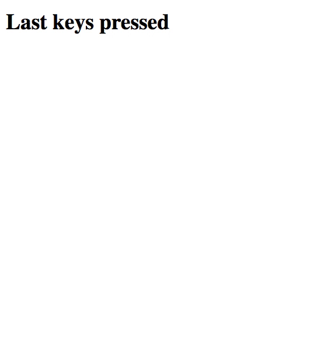

# `@rehooks/keypress`

> React hook for keypress events at the `window` level

> **Note:** This is using the new [React Hooks API Proposal](https://reactjs.org/docs/hooks-intro.html)
> which is subject to change until React 16.7 final.
>
> You'll need to install `react`, `react-dom`, etc at `^16.7.0-alpha.0`

## Install

```sh
yarn add @rehooks/keypress
```

## Usage

```js
import useKeyPress from '@rehooks/keypress';

function MyComponent() {
  const [keys, setKeys] = useState([]);

  function handleKeyPress({ key }) {
    setKeys(keys => [key, ...keys]);
  }

  useKeyPress(handleKeyPress);

  return (
    <div>
      <h3>Last keys pressed</h3>
      <ul>
        {keys.map(key => (
          <li>{key}</li>
        ))}
      </ul>
    </div>
  );
}
```

⚡️ And you get a simple keylogger component :


